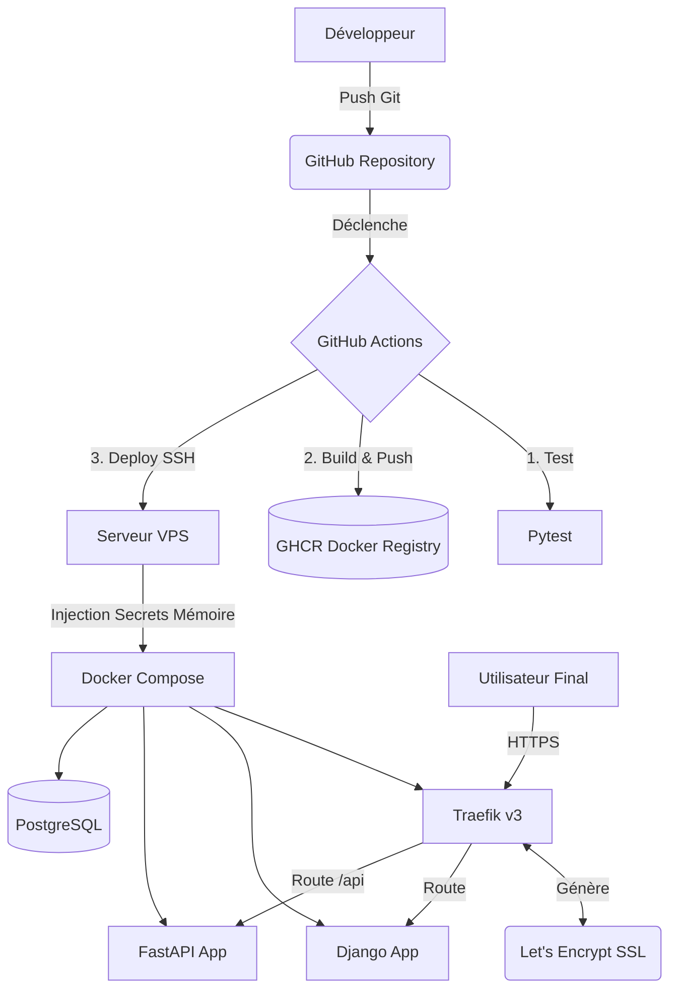

# Documentation Technique : CI/CD et Déploiement VPS

Ce document trace l'implémentation complète et finale de l'architecture de déploiement continu du projet `docker-political-solo`.

---

## 1. Architecture Finale

L'architecture repose sur la sécurité maximale (zéro secret sur le disque) et l'automatisation complète via GitHub Actions.

## 2. Fichiers de Déploiement Clés

### `docker-compose.prod.yml`
- Fichier central définissant les conteneurs de production.
- **Sécurité** : Plus de fichier `.env`. Les variables sont injectées dynamiquement via l'attribut `environment` depuis l'environnement système (`${VARIABLE}`).
- **Réseau** : Déclaration explicite du réseau (`name: predilection-net`) pour éviter les conflits de nommage Docker et permettre à Traefik de router correctement.

### `.github/workflows/deploy.yml`
- Pipeline CI/CD en 3 étapes :
  1. **Test** : Exécution de Pytest pour valider le code.
  2. **Build** : Création des images Docker et push sur le GitHub Container Registry (GHCR).
  3. **Deploy** : 
     - Envoi des fichiers de configuration (`docker-compose.prod.yml`, `scripts/deploy.sh`, `traefik/traefik.yml`) via `appleboy/scp-action`.
     - Exécution du script de déploiement via `appleboy/ssh-action`.
     - **Critique** : Injection de tous les secrets GitHub dans l'environnement SSH, assurant qu'ils n'existent qu'en RAM sur le VPS.

### `scripts/deploy.sh`
- Script de redémarrage exécuté sur le VPS.
- Récupère l'image depuis GHCR, exécute `docker compose up -d`, purge les anciennes images et vérifie la disponibilité de l'application via un Smoke Test HTTP (Curl).

### `traefik/traefik.yml`
- Configuration statique du reverse-proxy Traefik.
- Déclaration du challenge HTTP-01 de Let's Encrypt avec l'email `admin@docker-political.duckdns.org` pour générer automatiquement les certificats SSL.

---

## 3. Problèmes Rencontrés & Solutions Apportées

Lors de l'implémentation, plusieurs défis techniques ont été résolus :

### Problème 1 : Connexion et droits sur GHCR
- **Erreur** : `denied: unauthenticated` lors du pull GHCR depuis le VPS.
- **Cause** : Le token Github par défaut de l'action (`secrets.GITHUB_TOKEN`) manquait de permissions pour des dépôts spécifiques, ou n'était pas transféré.
- **Solution** : Injection explicite du token GitHub dans la commande SSH et ajout d'un `docker login` silencieux dans le `deploy.sh`.

### Problème 2 : Traefik "404 Page Not Found" & Docker API Version
- **Erreur** : L'application n'était pas servie, Traefik renvoyait systématiquement `404`. Les logs Traefik affichaient `client version 1.24 is too old. Minimum supported API version is 1.40`.
- **Cause** : Le moteur Docker Engine (v29+) sur le VPS rejette les clients utilisant des API obsolètes (v1.24). Traefik v3.3 tentait d'utiliser l'ancienne API par défaut, perdant ainsi le lien avec Docker et ne détectant aucun conteneur.
- **Solution** : Ajout de la variable `DOCKER_API_VERSION=1.41` dans le conteneur Traefik et mise à jour de l'image Traefik vers la dernière `v3`.

### Problème 3 : Let's Encrypt et le certificat SSL (HTTPS)
- **Erreur** : Avertissement SSL (`ERR_CERT_AUTHORITY_INVALID`) dans le navigateur. Les logs affichaient `contact email has forbidden domain "example.com"`.
- **Cause** : Let's Encrypt bannit la génération de certificats avec des adresses email de test ou génériques. Traefik ayant échoué une première fois, l'erreur est restée en cache dans le volume `acme.json`.
- **Solution** : Remplacement par une adresse valide (`admin@docker-political.duckdns.org`), et suppression manuelle du fichier corrompu `acme.json` sur le VPS via un conteneur éphémère (`docker run --rm alpine...`) pour forcer une nouvelle demande de certificat propre.

### Problème 4 : Incompatibilité du Nom de Réseau
- **Erreur** : Traefik affichait le warning `Could not find network named "predilection-net"`.
- **Cause** : Docker Compose ajoute par défaut le nom du dossier projet en préfixe des réseaux (ex: `docker-political_predilection-net`). Traefik cherchait le nom exact défini dans sa configuration statique.
- **Solution** : Forcer le nom exact du réseau dans `docker-compose.prod.yml` avec la clé `name: predilection-net`.
