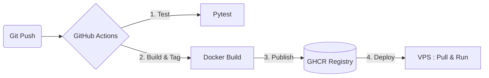

# Industrialisation et Déploiement MLOps
**Comment passer d'un projet local à un environnement de production sécurisé**

---

# 📖 1. Le Projet et le Besoin Traité

**Le Contexte :**
- Une application Data/IA fonctionnelle en local (Django + FastAPI + PostgreSQL).
- Objectif : Rendre cette application accessible publiquement de manière fiable pour des démonstrations et faciliter les futures mises à jour.

**Les Défis de l'Industrialisation :**
- Sécuriser un VPS OVH vierge exposé sur Internet.
- Ne pas exposer les conteneurs applicatifs directement.
- Automatiser la livraison (CI/CD) pour éviter les erreurs humaines.
- Gérer les secrets (mots de passe, clés d'API) de manière sécurisée.

<!-- 
Speaker Notes:
Bonjour à tous. Le projet d'aujourd'hui s'inscrit dans une vraie démarche DevOps et MLOps. Nous avions une application Data et IA qui tournait parfaitement sur le poste du développeur, mais le but était de la rendre accessible au reste de l'équipe et aux clients via un serveur OVH.
Le défi n'était pas de coder de nouvelles fonctionnalités, mais d'industrialiser l'existant : comment déployer de façon automatique, comment sécuriser un serveur nu exposé aux attaques, et comment s'assurer que notre base de données et nos modèles IA ne se retrouvent pas compromis.
-->

---

# 🛡️ 2. Les Mesures de Sécurité Appliquées au VPS

Un serveur nu est une cible. Voici la forteresse mise en place :

- **Mise à jour système** : `apt update && apt upgrade` à la première connexion.
- **Utilisateur dédié (`amaury`)** : Fin de l'utilisation de `root` pour les tâches courantes.
- **Accès SSH par clé Ed25519** : Désactivation totale de l'authentification par mot de passe.
- **Changement du port SSH** : Le port 22 a été fermé et remplacé par le port 1455 pour éviter les scripts automatisés de force brute.
- **Pare-feu (UFW)** : Seuls les ports vitaux sont ouverts (80 HTTP, 443 HTTPS, 1455 SSH).
- **Fail2ban** : Bannissement automatique des adresses IP tentant de forcer l'accès.

<!-- 
Speaker Notes:
La sécurité a été notre priorité. Dès la réception du VPS OVH, la première chose a été de tout mettre à jour. Ensuite, j'ai créé un utilisateur non-root pour réduire les risques de mauvaises manipulations.
Le plus important est l'accès SSH : j'ai imposé la connexion par clé cryptographique, coupé l'accès par mot de passe, et changé le port par défaut 22 vers le 1455. Le port SSH n'est qu'une sécurité par l'obscurité, c'est pourquoi il est doublé d'un pare-feu très strict avec UFW, et de Fail2ban qui observe les logs et bloque les IP malveillantes.
-->

---

# 🏗️ 3. L'Architecture de Déploiement

Pourquoi utiliser ces technologies ?

- **VPS** : L'hôte physique qui exécute notre application.
- **Docker & Docker Compose** : Garantissent que l'application tournera sur le serveur *exactement* comme elle tournait en local (reproductibilité).
- **Traefik (Reverse Proxy)** : Le gardien de la porte. C'est le seul composant exposé sur les ports 80 et 443. Il route les requêtes vers Django ou FastAPI sans exposer leurs ports internes.
- **Let's Encrypt** : Intégré à Traefik, il génère le certificat HTTPS automatiquement pour protéger les données en transit.

<!-- 
Speaker Notes:
Pour l'architecture, j'ai choisi une stack moderne. Docker et Docker Compose sont au cœur du système : ils isolent nos applications et la base PostgreSQL. 
Devant ces conteneurs, j'ai placé Traefik en tant que Reverse Proxy. C'est crucial : les ports internes de FastAPI ou Django ne sont pas ouverts sur Internet. Tout passe par Traefik qui agit comme un aiguilleur. L'immense avantage de Traefik est sa capacité à dialoguer avec Let's Encrypt pour obtenir et renouveler automatiquement notre certificat SSL HTTPS.
-->

---

# 🔐 4. La Gestion des Secrets : Zéro `.env` sur le VPS

**Le Risque :** Exposer des secrets (mots de passe BDD, clé Django) dans le code source ou dans un fichier en clair sur le serveur.

**La Solution CI/CD :**
1. Les secrets sont stockés de manière cryptée dans **GitHub Secrets**.
2. GitHub Actions se connecte au VPS via SSH.
3. Les secrets sont **injectés en tant que variables d'environnement en mémoire vive** directement dans la commande `docker compose up`.
4. **Bilan** : Aucun fichier contenant des mots de passe n'existe sur le disque dur du VPS.

<!-- 
Speaker Notes:
Un aspect critique de la sécurité est la gestion des secrets. Si le serveur est compromis ou si quelqu'un fouille le dossier, nous ne voulons pas qu'il trouve un fichier .env avec les mots de passe de la base de données.
J'ai donc conçu un système où les secrets sont gardés dans le coffre-fort de GitHub. Lors du déploiement, GitHub Actions injecte ces secrets directement dans la RAM du serveur via la session SSH. Ainsi, le fichier docker-compose lit les variables d'environnement du système, et aucun fichier physique ne contient nos mots de passe.
-->

---

# ⚙️ 5. La Pipeline CI/CD et la Registry

- **Tests automatisés** : Bloquent le déploiement si le code est cassé.
- **GitHub Container Registry (GHCR)** : Stocke chaque version de notre image Docker. Permet un retour arrière immédiat si besoin (Rollback).
- **Déploiement Automatisé** : Connexion SSH, téléchargement des images depuis GHCR, et redémarrage sans interruption (`up -d`).

<!-- 
Speaker Notes:
Voici comment une nouvelle fonctionnalité passe de mon ordinateur au serveur.
Dès que je valide un code sur GitHub, la pipeline se lance. Elle fait d'abord tourner les tests unitaires existants. Si ça casse, tout s'arrête.
Si c'est vert, elle compile les images Docker applicatives et leur donne un numéro de version avant de les stocker dans le GitHub Container Registry, notre registre privé.
Enfin, elle se connecte au VPS, demande au VPS de télécharger la nouvelle image depuis le registre, et relance l'application. Tout est tracé et chaque version est archivée.
-->

---

# 🚧 6. Incidents Rencontrés & Résolution

**Incident 1 : Traefik "404 Page Not Found"**
- *Diagnostic* : Traefik tentait de communiquer avec l'API Docker du VPS (v29) en utilisant une version obsolète (v1.24). L'API de Docker Engine bloquait la connexion, rendant Traefik "aveugle" aux conteneurs.
- *Solution* : Forcer `DOCKER_API_VERSION=1.41` dans le Compose et mettre à jour l'image Traefik vers la v3.

**Incident 2 : Let's Encrypt refuse de générer le HTTPS**
- *Diagnostic* : Let's Encrypt a refusé l'email `admin@example.com` défini par défaut. Traefik a mis en cache cet échec dans `acme.json`, bloquant toute nouvelle tentative même après correction du fichier yaml.
- *Solution* : Nettoyage manuel du volume Docker (`rm -f /letsencrypt/acme.json`) via un conteneur éphémère Alpine, pour forcer Traefik à repartir de zéro.

<!-- 
Speaker Notes:
L'industrialisation n'a pas été sans embûches. J'ai eu deux incidents très formateurs.
Le premier : l'application déployée renvoyait un 404. En lisant les logs, j'ai compris que le moteur Docker du tout nouveau VPS rejetait les requêtes de Traefik car elles utilisaient une API trop vieille. J'ai dû modifier la configuration de Traefik pour forcer l'usage d'une API Docker moderne.
Le deuxième : le cadenas HTTPS ne s'affichait pas. Let's Encrypt avait banni l'adresse email de test 'example.com'. Le piège, c'est que Traefik a mémorisé cette erreur. Pour débloquer la situation, j'ai dû me connecter au VPS et lancer un conteneur Linux minimaliste juste pour aller effacer le fichier de cache acme.json vérolé et relancer la procédure proprement.
-->

---

# 💻 7. Démonstration de la Release

*Scénario de la démonstration :*
1. Visite du site actuel (`https://docker-political.duckdns.org`).
2. Modification légère du code source en direct (ex: texte sur la page d'accueil).
3. `git commit` et `git push`.
4. Suivi visuel du pipeline GitHub Actions (Tests -> Build -> Deploy).
5. Actualisation du navigateur pour prouver la mise en production de la release.
6. Connexion rapide au VPS pour prouver l'absence de secret sur le disque.

<!-- 
Speaker Notes:
Assez parlé de théorie, passons à la pratique. 
Je vais vous montrer l'application en HTTPS, puis faire une modification de code en direct. Nous allons voir GitHub Actions prendre le relais, builder la nouvelle image, la pousser sur le registry et mettre à jour le serveur.
Pendant que ça tourne, je vous montrerai également le dashboard Traefik protégé par mot de passe, et le VPS lui-même pour vous prouver qu'il n'y a aucun secret en clair sur le disque.
-->

---

# 🔭 8. Limites Actuelles et Améliorations Futures

Ce VPS est parfait pour une démonstration pédagogique, mais en **production réelle d'entreprise**, il faudrait aller plus loin :

1. **Haute Disponibilité** : Remplacer le VPS unique par un cluster (Kubernetes ou Docker Swarm) pour éviter le *Single Point Of Failure* (SPOF).
2. **Base de données Managée** : Ne pas héberger PostgreSQL dans un conteneur sur le même serveur, mais utiliser un service cloud managé avec sauvegardes automatiques.
3. **Supervision & Alerting** : Installer Prometheus et Grafana pour surveiller la RAM, le CPU et recevoir un mail si l'application tombe.
4. **CI/CD** : Mettre en place des tests de charge et un environnement de *Staging* (pré-production) avant de déployer en production.

**Merci de votre écoute ! Des questions ?**

<!-- 
Speaker Notes:
Pour conclure, il est important d'avoir du recul sur notre travail. Ce VPS est sécurisé et industrialisé, mais il a ses limites. Si ce serveur tombe en panne, l'application est hors ligne (c'est un Single Point of Failure).
Dans une vraie entreprise avec de gros enjeux, nous migrerions vers Kubernetes pour la haute disponibilité. Nous externaliserions la base de données vers une solution managée pour garantir les sauvegardes, et nous ajouterions un système de supervision proactif comme Prometheus.
Je vous remercie pour votre attention et je suis prêt à répondre à vos questions.
-->
