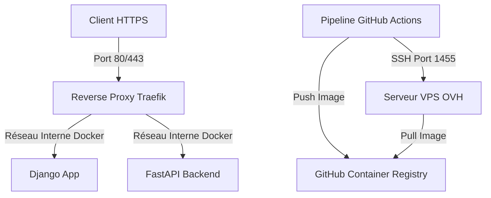

# Suivi d'Implémentation du Déploiement VPS et Sécurisation

Ce document trace l'avancement concret et l'état actuel des configurations réseau, de sécurité et d'infrastructure sur le VPS OVH.

---

## 🗺️ Architecture de Déploiement Cible

---

## 🛠️ État des Tâches & Progrès Réalisé

### 🔐 1. Sécurisation Minimale du VPS (`J1`)
- [x] **Mise à jour initiale du système** :
  - Commande exécutée : `sudo apt update && sudo apt upgrade -y`
- [x] **Création de l'utilisateur dédié au déploiement** :
  - Utilisateur configuré : `amaury` (membre du groupe `sudo` et `docker`).
- [x] **Accès SSH par clé sécurisé** :
  - Clé configurée : `ED25519 SHA256:cj8W6t3vFeXASmY8ELllErVHxw+usfQV5bjef3wEmu8`
- [x] **Modification du Port SSH** :
  - Port configuré : `1455` (sshd écoute correctement sur le port 1455).
- [x] **Pare-feu (UFW) Configuré** :
  - Profil actif :
    - `1455/tcp` (SSH) : ALLOW
    - `80/tcp` (HTTP) : ALLOW
    - `443/tcp` (HTTPS) : ALLOW
- [ ] **Protection contre les attaques par force brute** :
  - Installation et configuration de Fail2ban à finaliser.

### 🐳 2. Infrastructure Conteneurisée (`J1-J2`)
- [x] **Installation propre de Docker Engine (Docker CE)** :
  - Suppression de `docker.io` obsolète pour installer la version stable officielle.
  - Version installée : `Docker version 29.5.2, build 79eb04c`.
- [x] **Installation de Docker Compose Plugin** :
  - Version installée : `Docker Compose version v2.35.2` (ou plugin officiel `docker-compose-plugin`).
- [ ] **Déploiement de l'application via Docker Compose** :
  - Écriture du fichier `docker-compose.yml` de production.
- [ ] **Configuration de Traefik (Reverse Proxy)** :
  - Intégration de Traefik avec gestion automatique des certificats SSL (Let's Encrypt) et protection du dashboard par BasicAuth.

---

## 📋 Prochaines Actions Immédiates (J2)

1. Mettre en place la configuration de **Fail2ban** pour sécuriser les accès SSH contre le brute force.
2. Rédiger le fichier `docker-compose.prod.yml` intégrant Traefik et les services de l'application (`django`, `api`, `db`, `nginx`).
3. Générer les credentials d'accès protégés par BasicAuth pour le dashboard de Traefik.
